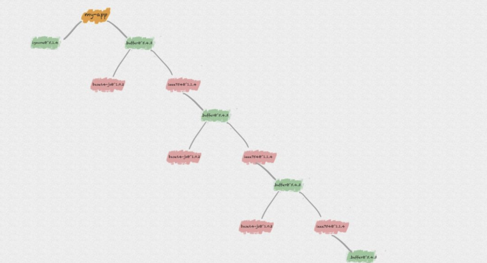
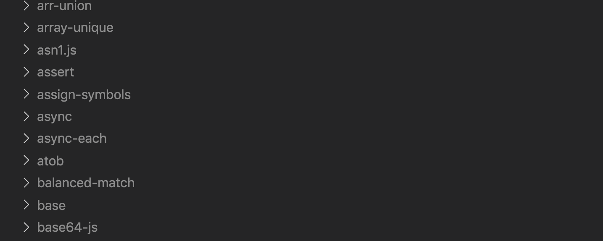
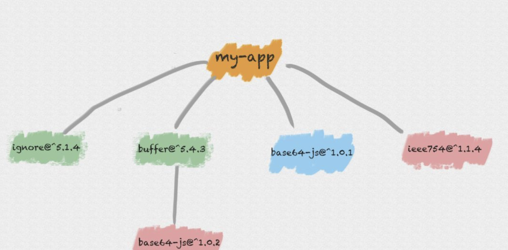

##  （六十九）NPM工作原理

> **`1：NPM模块(Module)`**
- `模块`
  - `每一个JavaScript文件都是一个模块，提供某些功能的实现`

  - `多个JS文件相互require，实现一个较为负复杂的功能并整体对外部提供一套功能`

  - `模块是划分功能的基本单位，并且提供完整的模块加载机制` 

  - `模块中定义的变量、函数、都只在当前模块中有效，使用时需要require引入`

  - `模块不仅限于JavaScript语言（C++、JSON...）`

- `模块划分`
  - `系统模块 - Node内置模块，可以直接使用`
    - `http`
    - `fs`
    - `net`
    - `url`
    - `path`
  - `用户模块 - 第三方或者自定义模块`
    - `nconf`
    - `webpack`
    - `post-css`

> **`2：NPM包(Package)`**
- `在模块基础上更深一步的抽象`

- `将某个独立的功能封装起来，用于发布、更新、依赖管理的版本控制`

- `NPM包规范`
    - <span style="color:rgba(215,186,125,1)">package.json<span style="color:red">必须</span>在包的顶层目录下</span>

    - <span style="color:rgba(215,186,125,1)">二进制文件<span style="color:green">应该</span>在bin目录下</span>

    - <span style="color:rgba(215,186,125,1)">javaScript代码<span style="color:green">应该</span>在lib目录下</span>

    - <span style="color:rgba(215,186,125,1)">文档<span style="color:green">应该</span>在doc目录下</span>

    - <span style="color:rgba(215,186,125,1)">单元测试<span style="color:green">应该</span>在test目录下</span>

    - `......`

> **`3：NPM依赖管理`**
- `nconf、webpack`

- `npm2 - 依次递归安装依赖`
    ```css
    node_modules/
    ├── nconf/
    └── webpack/
    ```

    ```css
    example@1.0.1
    ├─┬ nconf@0.8.5
    │ ├── async@1.5.2
    │ ├── ini@1.3.5
    │ ├── secure-keys@1.0.0
    │ └── yargs@3.32.0
    └─┬ webpack@1.15.0
    ├── acorn@3.3.0
    ├── async@1.5.2
    ├── clone@1.0.3
    ├── ...
    ├── optimist@0.6.1
    ├── supports-color@3.2.3
    ├── tapable@0.1.10
    ├── uglify-js@2.7.5
    ├── watchpack@0.2.9
    └─┬ webpack-core@0.6.9
        ├── source-list-map@0.1.8
        └── source-map@0.4.4
    ```
    - `优点`
        - `层级结构清晰`

        - `傻瓜式管理不容易出错`
    - `缺点`
        - `路径太深，触发Windows系统260长度限制`
        - `重复依赖过多`

        
- `npm3+ - 扁平结构`
    ```css
    example@1.0.1
    ├── lodash@4.17.15
    ├─┬ nconf@0.10.0
    │ ├── async@1.5.2
    │ ├── ini@1.3.5
    │ ├── secure-keys@1.0.0
    └─┬ webpack@1.15.0
      ├── acorn@3.3.0
      ├── async@1.5.2
      ├── clone@1.0.3
      ├── ...
      ├── optimist@0.6.1
      ├── supports-color@3.2.3
      ├── tapable@0.1.10
      ├── uglify-js@2.7.5
      ├── watchpack@0.2.9
      └─┬ webpack-core@0.6.9
        ├── source-list-map@0.1.8
        └── source-map@0.4.4
    ```
    

    ```css
    npm ls --depth 1
    ```

    ```css
    example@1.0.1
    ├── lodash@4.17.15
    ├─┬ nconf@0.10.0
    │ ├── async@1.5.2
    │ ├── ini@1.3.5
    │ ├── secure-keys@1.0.0
    │ └── yargs@3.32.0
    └─┬ webpack@4.41.5
    ├── @webassemblyjs/ast@1.8.5
    ├── @webassemblyjs/helper-module-context@1.8.5
    ├── @webassemblyjs/wasm-edit@1.8.5
    ├── @webassemblyjs/wasm-parser@1.8.5
    ├── acorn@6.4.0
    ├── ajv@6.11.0
    ├── ajv-keywords@3.4.1
    ├── chrome-trace-event@1.0.2
    ├── enhanced-resolve@4.1.1
    ├── eslint-scope@4.0.3
    ├── json-parse-better-errors@1.0.2
    ├── loader-runner@2.4.0
    ├── loader-utils@1.2.3
    ├── memory-fs@0.4.1
    ├── micromatch@3.1.10
    ├── mkdirp@0.5.1
    ├── neo-async@2.6.1
    ├── node-libs-browser@2.2.1
    ├── schema-utils@1.0.0
    ├── tapable@1.1.3
    ├── terser-webpack-plugin@1.4.3
    ├── watchpack@1.6.0
    └── webpack-sources@1.4.3
    ```

    
> **`4：NPM配置`**
- `npm config - 全局配置文件`
    - `proxy、https-proxy - npm代理地址`

    - `registry - npm源 - https://registry.npmjs.org/`

    - `package-lock - 是否启用lock`

    - `save - install后是否保存到dependencies`
- `npmrc - 项目内配置文件 - 优先级高于全局`
    ```css
    proxy = http://proxy.example.com/
    https-proxy = http://proxy.example.com/
    registry = http://registry.example.com/
    ```
> **`5：总结`**
```css
本节课从Package与Module的基本概念说起，介绍了NPM依赖的发展过程与安装策略，最后介绍了项目中常用的NPM相关配置
```