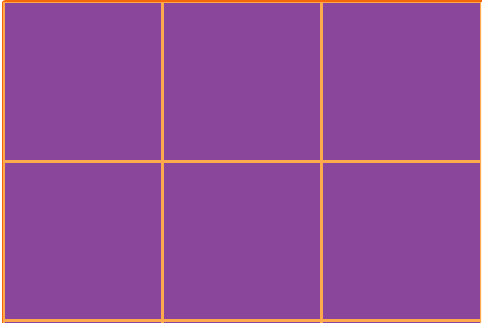
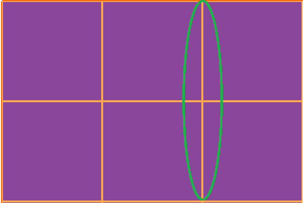
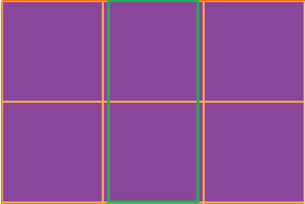
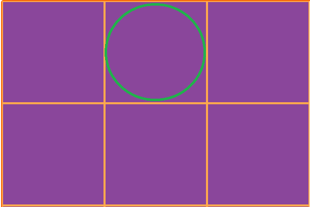
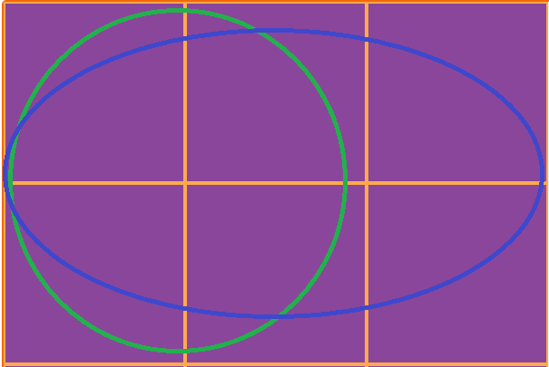

##  （九）Grid网格布局 (上)

> **`1：基本概念 (Grid Layout)`**

- **二维的基于网格的布局系统 (同时处理列和行)**

- **第一个专门为解决布局问题而生的CSS模块**

- **`Grid Container` - Grid容器 (设置了 display: gird 的元素)**
	```css
	.main {
	    display: grid;
	}
	```
	

- **`Grid Item` - Grid容器成员 (直接子元素)**
	```css
	<div class="main">
	    <div class="item"></div>
	    <div class="item"></div>
	    <div class="item"></div>
	</div> 
	```

- **`Grid Line` - Grid (行、列) 网格线**

	- **`垂直网格线 (column grid lines)`**

	- **`水平网格线 (row grid lines)`**

	

- **`Grid Track` - 两个相邻网格线之间的空间**

	

- **`Grid Cell` - 两个相邻的行和两个相邻的列网格线之间的空间, 基础单元**

	

- **`Grid Area` - 四个网格线包围的总空间, 可以由任意数量的Grid Cell组成**

	

> **`2：浏览器兼容`**

  

> **`3：Grid容器 (Grid Container) 属性`**
   ```css
	display

	grid-template-columns

	grid-template-rows

	grid-template-areas

	grid-template

	grid-column-gap

	grid-row-gap

	grid-gap

	justify-items

	align-items

	justify-content

	align-content

	grid-auto-columns

	grid-auto-rows

	grid-auto-flow

	grid
  ```
  - **`display`**
	- `grid (块级网格)`

	- `inline-grid (行级网格)`

	```css
	.main {
	    display: grid;
	}
	.main {
	    display: inline-grid;
	}
	```

  - **`grid-template-columns/rows (定义网格的列 / 行)`**
	```css
	.main {
	    grid-template-columns: [<Grid Line Name>] <Grid Track Size> ...;
        grid-template-rows: [<Grid Line Name>] <Grid Track Size> ...;
	}
	```

	- `基本用法`
		```css
		.main {
		    display: grid;
		    grid-template-columns: [columns-1] 100px [columns-2] 200px auto;
		    grid-template-rows: [rows-1] 100px [rows-2] 200px;
		}
		```

	- `重复`
		```css
		.main {
		    display: grid;
		    grid-template-columns: repeat(4, 100px [columns]) auto;
		    grid-template-rows: repeat(4, 100px [rows]);
		}
		```

	- `自由空间`
		```css
		.main {
		    display: grid;
		    grid-template-columns: 100px 1fr 3fr;
		    grid-template-rows: 100px 1fr 3fr;
		}
		```

	- **`grid-template-areas (定义网格模板)`**
		```css
		.header {
		    grid-area: header;
		    background: #8A469B;
		}
		.left {
		    grid-area: left;
		    background: #EA7F26;
		}
		.right {
		    grid-area: right;
		    background: #EA7F26;
		}
		.footer {
		    grid-area: footer;
		    background: #8A469B;
		}
		.main {
		    height: 500px;
		    display: grid;
		    grid-template-columns: 100px 100px auto 100px 100px;
		    grid-template-rows: 100px auto 100px;;
		    grid-template-areas:
		    	"header header header header header"
		    	"left left . . right"
		    	"footer footer footer footer footer";
		}
		```
	- **`grid-template-areas (rows、columns、areas简写)`**
		```css
		.main {
            height: 500px;
            display: grid;
            grid-template:
			[title-left] "title title title" 80px [title-right]
                [content-left] "left content content" 1fr [content-right]
                [footer-left] "left footer footer" 80px [footer-right]
                / 120px 1fr 120px;
        }
		```

  - **`grid-column/rows-gap (网格线宽度/高度)`**
	```css
	.main {
	    display: grid;
	    grid-template-columns: 100px 200px auto;
	    grid-template-rows: 100px 200px;
	    grid-column-gap: 20px;
        grid-row-gap: 20px;
	}
	```

  - **`grid-gap (rows、column缩写)`**
	```css
	.main {
	    display: grid;
	    grid-template-columns: 100px 200px auto;
	    grid-template-rows: 100px 200px;
	    grid-gap: 20px 30px;
	}
	```

  - **`justify-items (元素在Grid Cell横轴上的对齐方式)`**
	- `start`
	- `end`
	- `center`
	- `stretch - 默认值`
	```css
	.main {
	    display: grid;
	    justify-items: start;
	}
	```

  - **`align-items (元素在Grid Cell纵轴上的对齐方式)`**
	- `start`
	- `end`
	- `center`
	- `stretch - 默认值`
	```css
	.main {
	    display: grid;
	    align-items: start;
	}
	```

  - **`justify-content (Grid Cell在横轴上的对齐方式)`**
	- `start`
	- `end`
	- `center`
	- `stretch`
	- `space-around`
	- `space-between`
	- `space-evenly`
	```css
	.main {
	    display: grid;
	    justify-content: start;
	}
	```

  - **`align-content (Grid Cell在纵轴上的对齐方式)`**
	- `start`
	- `end`
	- `center`
	- `stretch`
	- `space-around`
	- `space-between`
	- `space-evenly`
	```css
	.main {
	    display: grid;
	    align-content: start;
	}
	```

  - **`grid-auto-columns/rows (自动生成网格(隐式) - 网格溢出时使用)`**
	- `基本语法`
		```css
		.main {
		    display: grid;
		    grid-auto-columns: <Grid Track Size> ...;
		    grid-auto-rows: <Grid Track Size> ...;
		}
		```

	- `不指定 grid-template-columns`

	- `指定 grid-template-columns`

  - **`grid-auto-flow (自动放置Grid容器成员)`**
	- `row` - 按行填充
	- `column` - 按列填充
	- `dense` - 按最小剩余空间填充(打乱布局, 使用较少)
	```css
	.main {
	    display: grid;
	    grid-auto-flow: row;
	}
	```

  - **`grid (template-rows、template-columns、template-areas、auto-rows、auto-columns、auto-flow简写)`**

	- `template-areas template-rows auto-flow auto-rows / grid-template-columns auto-flow auto-columns`

	```css
	.main {
	    grid: [row1-start] "header header header" 1fr [row1-end]
              [row2-start] "footer footer footer" 25px [row2-end]
              / auto 50px auto;
	}
	```